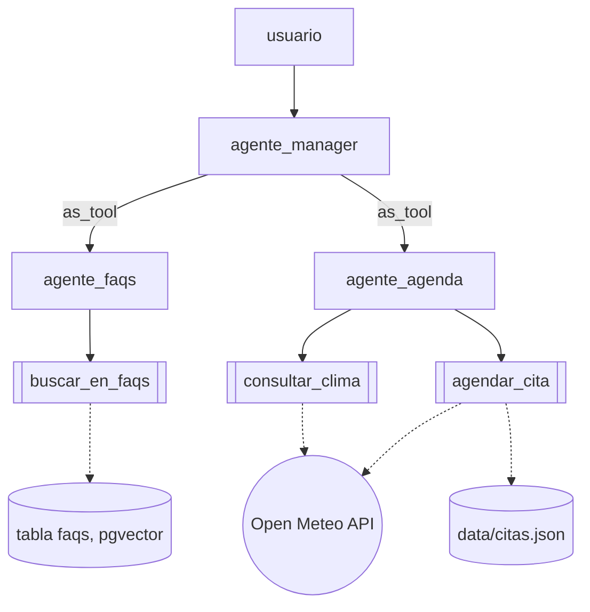

# Arquitectura centralizada

Programa: [`../centralizado.py`](../centralizado.py)

Un solo manager habla con el usuario. Los especialistas estan expuestos como
herramienta (`Agent.as_tool()`): el manager decide a cual delegar, recibe su
resultado y redacta la respuesta final. Los especialistas nunca le
responden directo al usuario.

