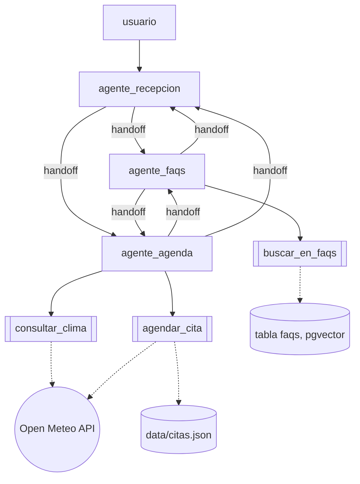

# Arquitectura decentralizada

Programa: [`../descentralizado.py`](../descentralizado.py)

Tres agentes pares, sin ningun supervisor que sintetice la respuesta final.
`agente_recepcion` es el punto de entrada del primer turno (solo enruta, no
tiene tools); una vez que `agente_faqs` o `agente_agenda` toma la conversacion
con `handoff()`, le responde directo al usuario y se queda a cargo de los
turnos siguientes, hasta que el o ella misma decida transferirla de nuevo.

`shared/cli.py` guarda `resultado.last_agent` despues de cada turno y lo usa
como punto de partida del siguiente: si `agente_faqs` tomo el control, el
proximo mensaje del usuario le llega primero a `agente_faqs`, no de vuelta a
`agente_recepcion`. Asi el handoff persiste entre turnos, no solo dentro de
una misma llamada al modelo.
