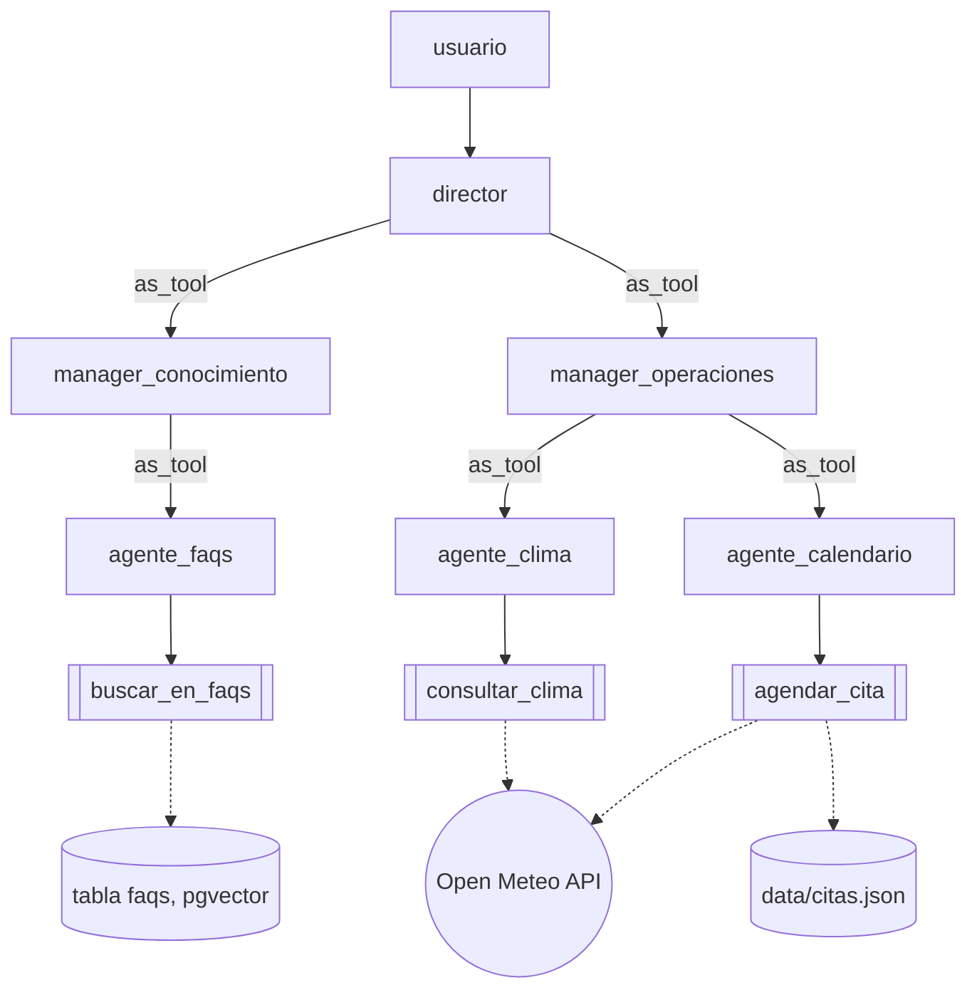

# Arquitectura jerarquica

Programa: [`../jerarquico.py`](../jerarquico.py)

Dos niveles de manager entre el usuario y las tools reales. El usuario solo
habla con `director`. `director` delega (`as_tool`) en el manager que
corresponda; ese manager vuelve a delegar (`as_tool`) en su propio worker, que
es el unico que llama la tool real. La respuesta sube de vuelta por los mismos
dos niveles antes de llegar al usuario.

Total: 3 agentes manager (`director`, `manager_conocimiento`,
`manager_operaciones`) sobre 3 agentes worker (`agente_faqs`, `agente_clima`,
`agente_calendario`), cada worker con una sola herramienta.
